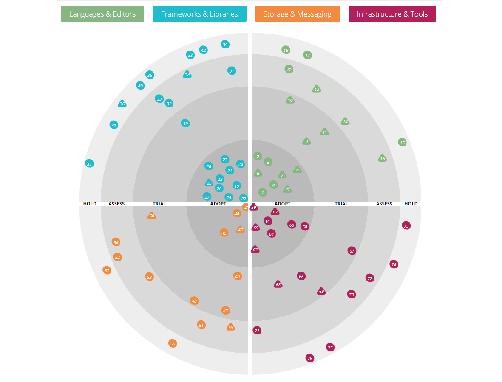

We are pleased to announce that we will publish the Bloemert Tech Radar! What used to be an internal tool, it will be now available to everyone.

## What is it?

> Insights into the technology and trends shaping the future

<!-- The Technology Radar is our thoughts on emerging technology trends in the industry. Read the latest here. -->
<!-- The Zalando Tech Radar is a list of technologies, complemented by an assessment result, called ring assignment. We use four rings with the following semantics ... -->

The Tech Radar is a way to follow technical trends in the software industry. Inspired by Thoughtworks and Zalando, we follow the latest and most relevant trends in our industry and qualify each technology. This way, we provide a clear picture of which technologies are new, interesting, recommended, dangerous and so on.

By we, we mean the Technical Steering Group (TSG) of Bloemert. The TSG is a group of technical experts that follow trends very closely and also have a lot of experience in different area's.

Mind that our radar is largely '.NET focused', although we definitely keep our eyes open for other technology stacks. 

## Why?

The Bloemert Tech Radar serves different purposes:

1. To inspire and advice development teams inside Bloemert, both internal and external projects.
2. To drive and support internal projects like traineeships, education, events and recruitment.
3. To show the outside world what our vision or view is on the available development stacks, and to show what we (probably) use or strive for.

<!-- And to show what tech we (probably) use or strive for. -->
<!-- It can also been seen as a contribution in the .NET and dev space. -->
<!-- We realize that we are not the authority that for example ThoughtWorks is, so we will not pretend it either.  -->

## How does it work?

The Tech Radar is divided in 4 so-called quadrants. Quadrant are area's / categories in which technologies reside. 

### Quadrants

- **Languages & Editors**. Programming languages and editors or IDE's. Markup languages are also included. 
- **Frameworks & Libraries**. Frameworks and libraries that can be used for programming. 
- **Storage & Messaging**. Mostly databases but also messaging and bus systems (temporary storage).
- **Infrastructure & Tools**. Primarily tools for development, DevOps, CI/CD but also infrastructure like hosting systems.

NB: Note that we have other quadrants than ThoughtWorks and Zalando. We have modified it so that it fits our needs. One important difference with ThoughtWorks is that we do not include *techniques*, or what we call *engineering guidelines & best practices*. We have another idea about that. Our radar only includes **concrete** technologies, most of the time they are real products. Sometimes this also *implies* the platform. For example: when we adopt Azure Functions, it is also pretty clear that we adopt Azure as a cloud platform.

### Rings
- **Adopt**. Please use this technology if you can. It is proven, mature and without risk to use. Strongly recommended.
- **Trial**. You can use this technology pretty safely. We have seen successful projects using it to solve real problems. However, it is too early, or we are not confident enough, to put it in the Adopt ring. Use it, but with care.
- **Assess**. Very promising technology with clear potential. It is worth to invest some time and to see if it might be something for you. We do not encourage to use it in current projects unless you think they would be a particularly good fit for you. Play with it, follow it closely.
- **Hold**. Please do not use this technology (anymore). Never use this on new projects and be aware that technology can be a big risk in existing projects. Strongly discouraged.

NB: Sometimes the opinions of the Hold rings differs. Some say it should only contain legacy, old, abandoned technologies while others say it should include technologies that are *not ready* (for example because of immaturity, stability, support etc.). The Bloemert Tech Radar follows the first statement, but this might change in the future.

### Blips

The blips, or dots, on the radar, represent the actual technologies. Please check in which quadrant and ring they belong to see how it is qualified by the TSG.

## Where is it?

[Bloemert Tech Radar](https://radar.bloemert.com)

## More info
For more info, please check out Tech Radars of ThoughtWorks and Zalando:

- [ThoughtWorks Radar](https://opensource.zalando.com/tech-radar/)
- [Zalando Radar](https://opensource.zalando.com/tech-radar/)
- [ThoughtWorks FAQ](https://www.thoughtworks.com/radar/faq)
