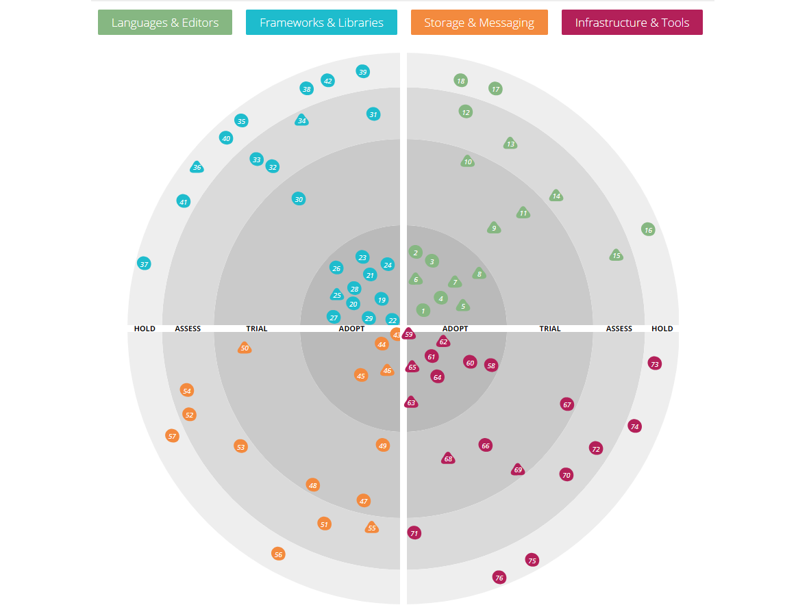

<!-- # Announcing the Bloemert Tech Radar 2019 -->
<!-- # Bloemert Tech Radar 2019 -->

We are pleased to announce the Bloemert Tech Radar 2019! 

## What is it?

> Insights into the technology and trends shaping the future

<!-- The Technology Radar is our thoughts on emerging technology trends in the industry. Read the latest here. -->

<!-- The Zalando Tech Radar is a list of technologies, complemented by an assessment result, called ring assignment. We use four rings with the following semantics ... -->

The Tech Radar is a way to follow technical trends in the software industry. Inspired by Thoughtworks and Zalando, we follow the latest and most relevant trends in our industry and qualify each technology. This way, you can get a clear picture of which technologies are new, interesting, recommended, dangerous and so on.

By we, we mean a Technical Steering Group (TSG) inside Bloemert. It is a group of technical experts that follow trends very closely and also have a lot of experience in different area's.

Mind that our radar is largely '.NET based', although we definitely keep our eyes open for other technology stacks. 

## Why?

The Bloemert Tech Radar serves different purposes:

1. To inspire and advice development teams inside Bloemert, both internal and external projects.
2. To drive and support internal projects like traineeship, education and recruitment.
3. To show the outside world what our vision or view is on the current development stack. Also to show what tech we (probably) use or strive for.

<!-- It can also been seen as a contribution in the .NET and dev space. -->
<!-- We realize that we are not the authority that for example ThoughtWorks it, so we will not pretend it either.  -->

## How does it work?

The Tech Radar is divided in 4 so-called quadrants. Quadrant are area's / categories in which technologies reside. 

### Quadrants

- **Languages & Editors**. Programming languages and editors or IDE's. Markup languages are also included. 
- **Frameworks & Libraries**. Frameworks and libraries that can be used for programming. 
- **Storage & Messaging**. Mostly databases but also messaging and bus systems (temporary storage).
- **Infrastructure & Tools**. Primarily tools for development, DevOps, CI/CD but also infrastructure like hosting systems.

NB: Note that we have other quadrants than ThoughtWorks and Zalando. We have modified it so that it fits our needs. One important difference with ThoughtWorks is that we do not include *techniques*, or what we call *guidelines & best practices*. We have another idea about that. Our radar only includes **concrete** technologies, most of the time they are real products. Sometimes this also *implies* the platform. For example: when we adopt Azure Functions, it is also pretty clear that we adopt Azure as a cloud platform.

### Rings

<!-- - Adopt. The Adopt ring represents blips that we think you should be using now. We don't say that you should use these for every project; any tool should only be used in an appropriate context. However we do think that a blip in the Adopt ring represents something where there's no doubt that it's proven and mature for use.
- Trial. The Trial ring is for blips that we think are ready for use, but not as completely proven as those in the Adopt ring. So for most organizations we think you should use these on a trial basis, to decide whether they should be part of your toolkit. Typically we're happy to use trial blips now, but we realize that most readers will be more cautious than us.
- Assess. The Assess ring are things that you should look at closely, but not necessarily trial yet - unless you think they would be a particularly good fit for you. Typically, blips in the Assess ring are things that we're currently trialling, on our projects.
- Hold. The Hold ring is for things that, even though they are accepted in the industry, we haven't had good experience with. Therefore we are calling them out to warn you that you may run into trouble with them as well. Sometimes this is because we don't think they're mature enough yet; sometimes it means we think they're irredeemably flawed; or just being misused. We do place things in the Hold ring that we wish the industry wouldn't use. -->

<!-- ADOPT — Technologies we have high confidence in to serve our purpose, also in large scale. Technologies with a usage culture in our Zalando production environment, low risk and recommended to be widely used.
TRIAL — Technologies that we have seen work with success in project work to solve a real problem; first serious usage experience that confirm benefits and can uncover limitations. TRIAL technologies are slightly more risky; some engineers in our organization walked this path and will share knowledge and experiences.
ASSESS — Technologies that are promising and have clear potential value-add for us; technologies worth to invest some research and prototyping efforts in to see if it has impact. ASSESS technologies have higher risks; they are often brand new and highly unproven in our organisation. You will find some engineers that have knowledge in the technology and promote it, you may even find teams that have started a prototyping effort.
HOLD — Technologies not recommended to be used for new projects. Technologies that we think are not (yet) worth to (further) invest in. HOLD technologies should not be used for new projects, but usually can be continued for existing projects. -->

- **Adopt**. Please use this technology if you can. It is proven, mature and without risk to use. Strongly recommended.
- **Trial**. You can use this technology pretty safely. We have seen successful projects to solve real problems. However, it is too early, or we are not confident enough, to put it in the Adopt ring. Use it, but with care.
- **Assess**. Very promising technology with clear potential. It is worth to invest some time and to see if it might something for you. But we do not encourage to use it in current projects unless you think they would be a particularly good fit for you. Play with it, follow it closely.
- **Hold**. Please do not use this technology (anymore). Never use this on new projects and be aware that technology can be a big risk in existing projects. Strongly discouraged.

NB: Sometimes the opinions of the Hold rings differs. Some say it should only contain legacy, old, abandoned technologies while others say it should include technologies that are *not ready* (for example because of immaturity, stability, support etc.). Currently, our radar follows the first statement, but in the future this might change.

### Blips

The blips, or dots, on the radar, are the actual technologies. Please check in which quadrant and ring they belong to see how it is qualified by the TSG.

## Where is it?

[Bloemert Tech Radar 2019](https://radar.bloemert.com)

## More info
For more info, please read the tech radars of ThoughtsWorks and Zalando:

- [ThoughtWorks Radar](https://opensource.zalando.com/tech-radar/)
- [Zalando Radar](https://opensource.zalando.com/tech-radar/)
- [ThoughtWorks FAQ](https://www.thoughtworks.com/radar/faq)
